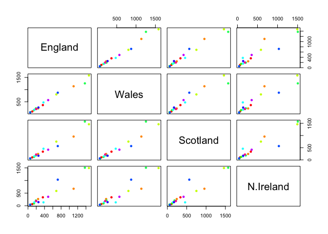

Class 9: Machine Learning pt1
================
Caitlin Johnson
2/4/2020

## K-means clustering

The main k-means function in R is called `kmeans()`. Let’s play with it
here

``` r
# rnorm makes a random data distribution from a norm, and genearates a two column database with x/y coordinates centered around -3 and 3 respectively.
#cbind combines objects by column
# rev just reverses the order of a list, column, etc?
tmp <- c(rnorm(30,-3), rnorm(30,3))
x <- cbind(x=tmp, y=rev(tmp))
plot(x)
```

<!-- -->
Use the kmeans() function setting k to 2 and nstart=20 Inspect/print the
results Q. How many points are in each cluster? A: 30 Q. What
‘component’ of your result object details - cluster size? A:
km\(size  - cluster assignment/membership? A: km\)cluster - cluster
center? km$centers

``` r
?kmeans
km <- kmeans(x, centers = 2, nstart = 20)
km
```

    ## K-means clustering with 2 clusters of sizes 30, 30
    ## 
    ## Cluster means:
    ##           x         y
    ## 1 -2.856214  3.035638
    ## 2  3.035638 -2.856214
    ## 
    ## Clustering vector:
    ##  [1] 1 1 1 1 1 1 1 1 1 1 1 1 1 1 1 1 1 1 1 1 1 1 1 1 1 1 1 1 1 1 2 2 2 2 2 2 2 2
    ## [39] 2 2 2 2 2 2 2 2 2 2 2 2 2 2 2 2 2 2 2 2 2 2
    ## 
    ## Within cluster sum of squares by cluster:
    ## [1] 49.40802 49.40802
    ##  (between_SS / total_SS =  91.3 %)
    ## 
    ## Available components:
    ## 
    ## [1] "cluster"      "centers"      "totss"        "withinss"     "tot.withinss"
    ## [6] "betweenss"    "size"         "iter"         "ifault"

``` r
km$size
```

    ## [1] 30 30

``` r
km$centers
```

    ##           x         y
    ## 1 -2.856214  3.035638
    ## 2  3.035638 -2.856214

``` r
km$cluster
```

    ##  [1] 1 1 1 1 1 1 1 1 1 1 1 1 1 1 1 1 1 1 1 1 1 1 1 1 1 1 1 1 1 1 2 2 2 2 2 2 2 2
    ## [39] 2 2 2 2 2 2 2 2 2 2 2 2 2 2 2 2 2 2 2 2 2 2

``` r
km$size
```

    ## [1] 30 30

``` r
km$cluster
```

    ##  [1] 1 1 1 1 1 1 1 1 1 1 1 1 1 1 1 1 1 1 1 1 1 1 1 1 1 1 1 1 1 1 2 2 2 2 2 2 2 2
    ## [39] 2 2 2 2 2 2 2 2 2 2 2 2 2 2 2 2 2 2 2 2 2 2

``` r
length(km$cluster)
```

    ## [1] 60

``` r
table(km$cluster)
```

    ## 
    ##  1  2 
    ## 30 30

``` r
km$centers
```

    ##           x         y
    ## 1 -2.856214  3.035638
    ## 2  3.035638 -2.856214

Plot x colored by the kmeans cluster assignment and add cluster centers
as blue points

``` r
plot(x, col=km$cluster+1)
points(km$centers, col = 'blue')
```

<!-- -->

``` r
#col = km$cluster is assigning a color to each cluster based on its cluster number
#The +2 is to get different colors, going through the color list?
# The points function allows us to color specific points a certain color.
```

\#\#Hierarchical Clustering

The main Hierarchical Clustering function in R is called `hclust()` An
important point here is that you have to calculate the distance matrix
deom your input data before calling `hclust()`

``` r
# First we need to calculate point (dis)similarity
# as the Euclidean distance between observations
dist_matrix <- dist(x)
# The hclust() function returns a hierarchical
# clustering model
hc <- hclust(d = dist_matrix)
# the print method is not so useful here
hc 
```

    ## 
    ## Call:
    ## hclust(d = dist_matrix)
    ## 
    ## Cluster method   : complete 
    ## Distance         : euclidean 
    ## Number of objects: 60

``` r
# Our input is a distance matrix from the dist()
# function. Lets make sure we understand it first
dist_matrix <- dist(x)
dim(dist_matrix)
```

    ## NULL

``` r
dim(x)
```

    ## [1] 60  2

``` r
dim(as.matrix(dist_matrix))
```

    ## [1] 60 60

People often view the results of Hierarchical clustering graphically.
Let’s try passing this to the `plot()` function

``` r
plot(hc)
#This draws a dendrogram
#We can add aline to help visualize cutree
abline( h=6, col='red')
abline(h=4, col = 'blue')
```

<!-- -->

``` r
#To get cluster membership vectors we need to 'cut' the tree at a certain height to yield our separate cluster branches
cutree(hc, h=6) #Cuts by height h
```

    ##  [1] 1 1 1 1 1 1 1 1 1 1 1 1 1 1 1 1 1 1 1 1 1 1 1 1 1 1 1 1 1 1 2 2 2 2 2 2 2 2
    ## [39] 2 2 2 2 2 2 2 2 2 2 2 2 2 2 2 2 2 2 2 2 2 2

``` r
gp4 <- cutree(hc, h=4)
table(gp4)
```

    ## gp4
    ##  1  2  3  4  5  6 
    ## 17  4  9 17  4  9

``` r
#We can use k to indicate how many groups we want
cutree(hc, k=4)
```

    ##  [1] 1 2 1 1 1 1 1 1 1 1 1 1 1 1 2 1 1 1 1 1 1 1 1 1 1 1 1 2 2 1 3 4 4 3 3 3 3 3
    ## [39] 3 3 3 3 3 3 3 4 3 3 3 3 3 3 3 3 3 3 3 3 4 3

``` r
# Step 1. Generate some example data for clustering
x <- rbind(
 matrix(rnorm(100, mean=0, sd = 0.3), ncol = 2), # c1
 matrix(rnorm(100, mean = 1, sd = 0.3), ncol = 2), # c2
 matrix(c(rnorm(50, mean = 1, sd = 0.3), # c3
 rnorm(50, mean = 0, sd = 0.3)), ncol = 2))
colnames(x) <- c("x", "y")
x
```

    ##                  x            y
    ##   [1,] -0.21539541  0.044019889
    ##   [2,] -0.02278557 -0.413880164
    ##   [3,] -0.54802500 -0.173010619
    ##   [4,] -0.05043746 -0.098396040
    ##   [5,]  0.37277547 -0.044471032
    ##   [6,] -0.29166410 -0.133506409
    ##   [7,] -0.09570281  0.261131781
    ##   [8,] -0.20897398  0.453986698
    ##   [9,]  0.13632955 -0.209450763
    ##  [10,] -0.08909832  0.186721565
    ##  [11,] -0.20554249  0.325613288
    ##  [12,] -0.42168343  0.170596520
    ##  [13,] -0.47400122 -0.140316033
    ##  [14,] -0.48336885 -0.459167921
    ##  [15,] -0.26570663  0.158811938
    ##  [16,] -0.20624871  0.197457225
    ##  [17,]  0.25983342 -0.441384820
    ##  [18,] -0.26314430  0.043649981
    ##  [19,] -0.19142529  0.224984136
    ##  [20,]  0.32734831 -0.037054367
    ##  [21,] -0.35998065  0.598837166
    ##  [22,]  0.65219013  0.112535914
    ##  [23,]  0.37175105 -0.542168059
    ##  [24,]  0.20196045 -0.133180163
    ##  [25,] -0.13866732 -0.074299881
    ##  [26,]  0.11964969  0.082121627
    ##  [27,] -0.20005472 -0.346925483
    ##  [28,]  0.19649072  0.121702160
    ##  [29,] -0.12871426 -0.453596499
    ##  [30,] -0.33140331 -0.049051037
    ##  [31,] -0.21684334  0.776132703
    ##  [32,] -0.14138166 -0.005453546
    ##  [33,] -0.03934049 -0.004050021
    ##  [34,] -0.28964299 -0.444737600
    ##  [35,] -0.39344468 -0.176357700
    ##  [36,] -0.10215599 -0.201015823
    ##  [37,]  0.02517085 -0.376396335
    ##  [38,]  0.12152242 -0.242916388
    ##  [39,] -0.19078616 -0.138047892
    ##  [40,]  0.06691728 -0.013989256
    ##  [41,] -0.48234037  0.524985504
    ##  [42,]  0.17667714  0.017241070
    ##  [43,] -0.13401580 -0.120391626
    ##  [44,] -0.20523415  0.213730026
    ##  [45,]  0.28503574 -0.297680962
    ##  [46,] -0.01439428  0.098965757
    ##  [47,] -0.02076329  0.413009323
    ##  [48,]  0.26543291 -0.112489600
    ##  [49,]  0.36201094 -0.220905646
    ##  [50,] -0.27802758  0.110513177
    ##  [51,]  1.48809464  0.973294285
    ##  [52,]  0.85583250  0.814723466
    ##  [53,]  0.94829127  0.950247988
    ##  [54,]  0.82654872  0.884585637
    ##  [55,]  0.97182969  0.946472693
    ##  [56,]  1.05869975  0.769510844
    ##  [57,]  0.89430800  1.206228487
    ##  [58,]  1.37313507  0.321894919
    ##  [59,]  1.04663253  0.858062494
    ##  [60,]  0.54493246  1.086619527
    ##  [61,]  1.13563347  0.946437203
    ##  [62,]  0.90230669  0.996377258
    ##  [63,]  1.22842329  1.267860997
    ##  [64,]  1.11272847  0.882919690
    ##  [65,]  0.54147812  1.253674526
    ##  [66,]  1.06301652  1.149120371
    ##  [67,]  0.63850537  1.386069801
    ##  [68,]  1.11082361  0.865762757
    ##  [69,]  1.43739810  0.789032950
    ##  [70,]  1.17480783  0.874220190
    ##  [71,]  1.04203150  1.019334834
    ##  [72,]  1.11442881  0.636786271
    ##  [73,]  1.12983120  0.371344724
    ##  [74,]  1.18105020  1.114705763
    ##  [75,]  1.13894870  0.625248601
    ##  [76,]  0.87590407  1.232537985
    ##  [77,]  0.88134643  0.856323177
    ##  [78,]  0.84684266  0.844265416
    ##  [79,]  1.16212602  0.850461390
    ##  [80,]  1.28871222  0.826282521
    ##  [81,]  0.95440759  0.876253532
    ##  [82,]  0.64618338  1.096829585
    ##  [83,]  1.05232009  1.215885484
    ##  [84,]  0.29744358  0.686573610
    ##  [85,]  0.64060947  0.720197952
    ##  [86,]  0.62228763  0.852361564
    ##  [87,]  0.63868254  1.034221854
    ##  [88,]  1.21290893  1.066742512
    ##  [89,]  1.23279816  0.694380682
    ##  [90,]  1.03696184  1.030011916
    ##  [91,]  0.38503476  1.002818515
    ##  [92,]  0.75262515  0.627923678
    ##  [93,]  0.51242580  0.954609245
    ##  [94,]  1.01964002  1.296528030
    ##  [95,]  0.90206005  1.126774589
    ##  [96,]  0.49640218  0.783089751
    ##  [97,]  0.93194721  1.614925512
    ##  [98,]  0.60373676  0.981918951
    ##  [99,]  0.80893364  0.721833073
    ## [100,]  1.60751496  1.016952943
    ## [101,]  0.64289099  0.307829489
    ## [102,]  1.05247303  0.247052321
    ## [103,]  0.68350351 -0.246314683
    ## [104,]  1.21099233  0.013870843
    ## [105,]  0.86871498  0.094649442
    ## [106,]  1.15911828 -0.043107163
    ## [107,]  0.76839516 -0.587903806
    ## [108,]  1.15564045  0.071763744
    ## [109,]  1.17799845  0.074718510
    ## [110,]  1.48956807  0.384674920
    ## [111,]  1.00901826 -0.858170437
    ## [112,]  1.12579983  0.292731133
    ## [113,]  1.28078805 -0.360058148
    ## [114,]  0.98255971 -0.465206944
    ## [115,]  0.66125070 -0.272147220
    ## [116,]  0.69798532  0.339985591
    ## [117,]  0.98695957 -0.263911617
    ## [118,]  1.05486095 -0.020025698
    ## [119,]  1.11141356 -0.239818271
    ## [120,]  0.17367959  0.047267796
    ## [121,]  0.68258372 -0.054015247
    ## [122,]  1.30036405 -0.554435641
    ## [123,]  1.18139855  0.111875379
    ## [124,]  0.94224521  0.409044258
    ## [125,]  1.54429074  0.408616245
    ## [126,]  1.07282981 -0.277997154
    ## [127,]  1.08905432  0.185151129
    ## [128,]  0.75197341  0.240814554
    ## [129,]  0.29962384 -0.033097108
    ## [130,]  0.96979761 -0.114445307
    ## [131,]  1.05146563  0.488084229
    ## [132,]  1.45519123  0.139760779
    ## [133,]  1.41748644  0.151478882
    ## [134,]  0.64919473  0.123987088
    ## [135,]  1.03637321  0.324487759
    ## [136,]  0.86221705 -0.272378096
    ## [137,]  1.14883894  0.183031903
    ## [138,]  1.10987365  0.128321466
    ## [139,]  0.83458138 -0.326867740
    ## [140,]  0.70663154 -0.100610077
    ## [141,]  1.22466298  0.013815257
    ## [142,]  0.84850453  0.176583673
    ## [143,]  1.88061217  0.240098390
    ## [144,]  1.02623769 -0.175943681
    ## [145,]  0.69360750  0.105910332
    ## [146,]  1.23013646  0.540078336
    ## [147,]  0.29850445  0.086786105
    ## [148,]  1.29450981 -0.273598153
    ## [149,]  0.97825554  0.295206505
    ## [150,]  1.98350541 -0.717500923

``` r
# Step 2. Plot the data without clustering
plot(x)
```

<!-- -->

``` r
# Step 3. Generate colors for known clusters
# (just so we can compare to hclust results)
col <- as.factor( rep(c("c1","c2","c3"), each=50) )
plot(x, col=col)
```

<!-- -->

``` r
#col groups
plot(hclust(dist(x)))
```

<!-- -->

``` r
table(cutree(hclust(dist(x)), k = 2))
```

    ## 
    ##  1  2 
    ## 52 98

``` r
plot(x, col = cutree(hclust(dist(x)), k = 2))
```

<!-- -->

``` r
#2 clusters
table(cutree(hclust(dist(x)), k = 3))
```

    ## 
    ##  1  2  3 
    ## 52 91  7

``` r
plot(x, col = cutree(hclust(dist(x)), k = 3))
```

<!-- -->

``` r
# 3 clusters
```

Q. Use the dist(), hclust(), plot() and cutree() functions to return 2
and 3 clusters A: see above Q. How does this compare to your known ‘col’
groups? A: The one with 3 groups is pretty similar to ‘col’ groups, with
only a few points differing

``` r
#Idk what this is
hc <- hclust(dist(x))
plot(hc)

abline(h=2.7, col='blue')

abline(h=2.2, col= 'green')
```

<!-- -->
To get cluster membership vector use `cutree()` and then use `table()`
to tabulate up how many members in each cluster we have

``` r
grps <- cutree(hc, k=3)
table(grps)
```

    ## grps
    ##  1  2  3 
    ## 52 91  7

``` r
plot(x, col = grps)
```

<!-- -->

``` r
x <- rbind(
 matrix(rnorm(100, mean=0, sd = 0.3), ncol = 2), # c1
 matrix(rnorm(100, mean = 1, sd = 0.3), ncol = 2), # c2
 matrix(c(rnorm(50, mean = 1, sd = 0.3), # c3
 rnorm(50, mean = 0, sd = 0.3)), ncol = 2))
colnames(x) <- c("x", "y")
plot(x)
```

<!-- -->

``` r
col <- as.factor( rep(c("c1","c2","c3"), each=50) )
plot(x, col=col)
```

<!-- -->

\#\#PCA of UK food Data

``` r
x <- read.csv('UK_foods.csv', row.names = 1)
x
```

    ##                     England Wales Scotland N.Ireland
    ## Cheese                  105   103      103        66
    ## Carcass_meat            245   227      242       267
    ## Other_meat              685   803      750       586
    ## Fish                    147   160      122        93
    ## Fats_and_oils           193   235      184       209
    ## Sugars                  156   175      147       139
    ## Fresh_potatoes          720   874      566      1033
    ## Fresh_Veg               253   265      171       143
    ## Other_Veg               488   570      418       355
    ## Processed_potatoes      198   203      220       187
    ## Processed_Veg           360   365      337       334
    ## Fresh_fruit            1102  1137      957       674
    ## Cereals                1472  1582     1462      1494
    ## Beverages                57    73       53        47
    ## Soft_drinks            1374  1256     1572      1506
    ## Alcoholic_drinks        375   475      458       135
    ## Confectionery            54    64       62        41

Lets make some plots to explore our data a bit
more

``` r
barplot(as.matrix(x), beside = F, col = rainbow(nrow(x)))
```

<!-- -->

``` r
pairs(x, col= rainbow(10), pch =16)
```

<!-- -->

``` r
#this makes a matrix of scatterplots comparing the data for different countries. For example, the scatterplot to the right of England and above Wales is comparing their consumption of different foods, with Wales on the x-axis and England on the y-axis. The next graph over to the right is comparing England and Scotland, with Scotland on the x-axis and England on the y-axis.
?pairs
```

Principal Component Analysis (PCA) with the `prcomp()` function

``` r
# Use the prcomp() PCA function 
pca <- prcomp( t(x) )
summary(pca)
```

    ## Importance of components:
    ##                             PC1      PC2      PC3       PC4
    ## Standard deviation     324.1502 212.7478 73.87622 4.189e-14
    ## Proportion of Variance   0.6744   0.2905  0.03503 0.000e+00
    ## Cumulative Proportion    0.6744   0.9650  1.00000 1.000e+00

``` r
?prcomp
```

What is in my result object `pca`? I can check the attributes\!

``` r
attributes(pca)
```

    ## $names
    ## [1] "sdev"     "rotation" "center"   "scale"    "x"       
    ## 
    ## $class
    ## [1] "prcomp"

``` r
plot(pca$x[,1], pca$x[,2], xlab = 'PC1', ylab = 'PC2', xlim=c(-270,500))
text(pca$x[,1], pca$x[,2], colnames(x), col = c('grey', 'red', 'blue', 'green'))
```

<!-- -->

kmeans(x, centers = , nstart =) hclust(dist(x)) prcomp(t(x))
