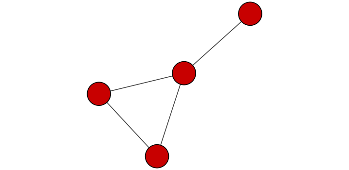
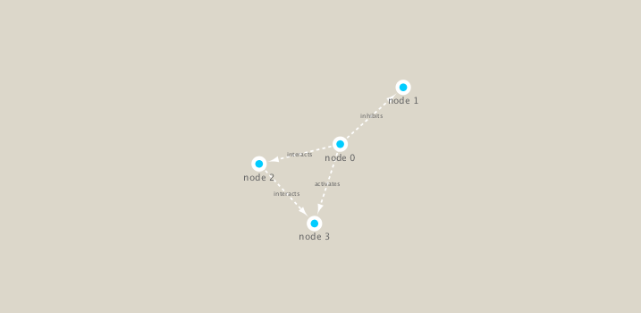

```{r setup, include=FALSE}
knitr::opts_chunk$set(echo = TRUE)
```
First setup the packages we need. These include **igraph** from CRAN and **RCY3** from bioconductor
```{r}
library(RCy3)
library(igraph)
library(RColorBrewer)
```
Let's test the connection to Cytoscape
```{r}
cytoscapePing()
```
Now let's check to version of Cytoscape we're currently using
```{r}
cytoscapeVersionInfo()
```
Let's test things further by making a small network in igraph and sending it to Cytoscape
```{r}
g <- makeSimpleIgraph()
createNetworkFromIgraph(g, "myGraph")
```
We can include this Cytoscape rendered network image in our report with the following code:
```{r}
fig <- exportImage(filename='demo', type='png', height=350)
```
```{r}

```
###Switch Styles
```{r}
setVisualStyle("Marquee")
```
Let's save this visualization as well
```{r}
fig <- exportImage(filename="demo_marquee", type="png", height=350)


```
We can also plot this simple network in R itself
```{r}
plot(g)
```
###Read our metagenomics data
Our data today comes from the TARA oceans study.

We will read in a species co-occurrence matrix that was calculated using Spearman Rank coefficient.

Let's read the file
```{r}
## scripts for processing located in "inst/data-raw/"
prok_vir_cor <- read.delim("virus_prok_cor_abundant.tsv", stringsAsFactors = FALSE)

## Have a peak at the first 6 rows
head(prok_vir_cor)
```
How many connections (i.e. edges) will we have in our network? Let's look at the number of rows!
```{r}
nrow(prok_vir_cor)
```

Here we will use the igraph package to convert the co-occurrence dataframe into a network that we can send to Cytoscape. In this case our graph is undirected (so we will set directed = FALSE) since we do not have any information about the direction of the interactions from this type of data.
```{r}
g <- graph.data.frame(prok_vir_cor, directed = F)
```
Let's make sure our new object g is an igraph
```{r}
class(g)
```
```{r}
g
```
In this case the first line of output (“UNW- 854 1544 –”) tells that our network graph has 845 vertices (i.e. nodes, which represent our bacteria and viruses) and 1544 edges (i.e. linking lines, which indicate their co-occurrence).
```{r}
plot(g)
```
This is a mess! Let's first turn off the labels
```{r}
plot(g, vertex.label=NA)
```
The nodes/vertex are too big, so let's make them smaller
```{r}
plot(g, vertex.size=3, vertex.label=NA)
```
###: Optional: ggplot
You can also use the ggplot extension package for networks called ggraph.
```{r}
library(ggraph)
```
```{r}
ggraph(g, layout = 'auto') +
  geom_edge_link(alpha=0.25) +
  geom_node_point(color = 'steelblue') +
  theme_graph()
```
To send this network to Cytospace we can use the command:
```{r}
createNetworkFromIgraph(g, 'myIgraph')
```
###Network querys
We can query (and set) vertex adn edge attributes with the V() and E() functions respectively
```{r}
V(g)
```
```{r}
E(g)
```


###Network community detection
Let's cluster our network to find "community" structure...

Community structure detection algorithms try to find dense sub-graphs within larger network graphs (i.e. clusters of well connected nodes that are densely connected themselves but sparsely connected to other nodes outside the cluster) . Here we use the classic Girvan & Newman betweenness clustering method. The igraph package has lots of different community detection algorithms (i.e. different methods for finding communities).

```{r}
cb <- cluster_edge_betweenness(g)
```
```{r}
cb
```

```{r}
plot(cb, y=g, vertex.label=NA, vertex.size=3)
```

We can extract a cluster/community membership vector for further inspection with the membership() function:
```{r}
head(membership(cb))
```
###Node Degree
The degree of a node or vertex is its most basic structural property, the number of its adjacent edges.
Let's calculate and plot the node degree distribution
```{r}
d <- degree(g)
hist(d, breaks=30, col= 'lightblue', main = 'Node Degree Distribution')
```
For the degree_distribution() function a numeric vector of the same length as the maximum degree plus one is returned. The first element is the relative frequency zero degree vertices, the second vertices with degree one, etc.
```{r}
plot(degree_distribution(g), type = 'h')
```

###Centrality analysis
Centrality gives an estimation on how important a node or edge is for the connectivity (or the information flow) of a network. It is a particularly useful parameter in signaling networks and it is often used when trying to find drug targets for example.
```{r}
pr <- page_rank(g)
head(pr$vector)
```
Lets plot our network with nodes size scaled via this page rank centrality scores.

```{r}
# Make a size vector btwn 2 and 20 for node plotting size

v.size <- BBmisc::normalize(pr$vector, range=c(2,20), method="range")
plot(g, vertex.size=v.size, vertex.label=NA)
```

One of the simplest centrality scores is of course node degree which we calculated previously and stored as the object d. Lets plot this one out also
```{r}
v.size <- BBmisc::normalize(d, range=c(2, 20), method = 'range')
plot(g, vertex.size = v.size, vertex.label=NA)
```
Another very common centrality score is betweenness. The vertex and edge betweenness are (roughly) defined by the number of geodesics (shortest paths) going through a vertex or an edge.
```{r}
b <- betweenness(g)
v.size <- BBmisc::normalize(b, range=c(2, 20), method = 'range')
plot(g, vertex.size =v.size, vertex.label = NA)
```
###Read taxonomic classification for network annotation
```{r}
phage_id_affiliation <- read.delim('phage_ids_with_affiliation.tsv')
head(phage_id_affiliation)
```
```{r}
bac_id_affi <- read.delim('prok_tax_from_silva.tsv', stringsAsFactors = F)
head(bac_id_affi)
```

###Add taxonomic annotation data to network
In preparation for sending the networks to Cytoscape we will add in the taxonomic data
```{r}
## Extract out our vertex names
genenet.nodes <- as.data.frame(vertex.attributes(g), stringsAsFactors=FALSE)
head(genenet.nodes)
```
How many phage(i.e ph_) entries do we have?
```{r}
length( grep("^ph_",genenet.nodes[,1]) )
```
This means we have 81 non-phage nodes (since we have 854 total nodes)

Now lets merge() these with the annotation data
```{r}
# We dont need all annotation data so lets make a reduced table 'z' for merging
z <- bac_id_affi[,c("Accession_ID", "Kingdom", "Phylum", "Class")]
n <- merge(genenet.nodes, z, by.x="name", by.y="Accession_ID", all.x=TRUE)
head(n)
```

```{r}
# Check on the column names before deciding what to merge
colnames(n)
```

```{r}
colnames(phage_id_affiliation)
```

```{r}
# Again we only need a subset of `phage_id_affiliation` for our purposes
y <- phage_id_affiliation[, c("first_sheet.Phage_id_network", "phage_affiliation","Tax_order", "Tax_subfamily")]

# Add the little phage annotation that we have
x <- merge(x=n, y=y, by.x="name", by.y="first_sheet.Phage_id_network", all.x=TRUE)

## Remove duplicates from multiple matches
x <- x[!duplicated( (x$name) ),]
head(x)
```
Save our merged annotation results back to `genenet.nodes`
```{r}
genenet.nodes <- x
```

###Send network to Cytoscape using RCy3
Now we will send this network from R to Cytoscape.

To begin we will delete any windows and networks that were already open in Cytoscape. This will clean the slate and help ensure we don’t use up all of our memory.
```{r}
# Open a new connection and delete any existing windows/networks in Cy
deleteAllNetworks()
```
We will need to set the first column in our node data.frame to id as this is what the RCy3 function createNetworkFromDataFrames() expects. Note that additional columns are loaded into Cytoscape as node attributes

Likewise the edge data.frame should contain columns of character strings named: source, target and interaction (with additional columns loaded as edge attributes).

```{r}
# Set the main nodes colname to the required "id" 
colnames(genenet.nodes)[1] <- "id"
```

Add to the network the data related to the connections between the organisms, the edge data, and then send the nodes and edges data.frames to Cytoscape using the function createNetworkFromDataFrames().

```{r}
genenet.edges <- data.frame(igraph::as_edgelist(g))

# Set the main edges colname to the required "source" and "target" 
colnames(genenet.edges) <- c("source","target")

# Add the weight from igraph to a new column...
genenet.edges$Weight <- igraph::edge_attr(g)$weight

# Send as a new network to Cytoscape
createNetworkFromDataFrames(genenet.nodes,genenet.edges, 
                            title="Tara_Oceans")
```
###Publishing your network to NDEx-
This is done outside of R

