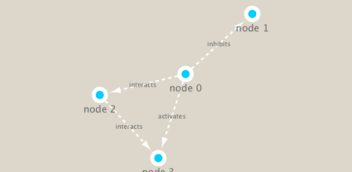

```{r setup, include=FALSE}
knitr::opts_chunk$set(echo = TRUE)
```
First setup the packages we need. These include **igraph** from CRAN and **RCY3** from bioconductor
```{r}
library(RCy3)
library(igraph)
library(RColorBrewer)
```
Let's test the connection to Cytoscape
```{r}
cytoscapePing()
```
Now let's check to version of Cytoscape we're currently using
```{r}
cytoscapeVersionInfo()
```
Let's test things further by making a small network in igraph and sending it to Cytoscape
```{r}
g <- makeSimpleIgraph()
createNetworkFromIgraph(g, "myGraph")
```
We can include this Cytoscape rendered network image in our report with the following code:
```{r}
fig <- exportImage(filename='demo', type='png', height=350)
```
```{r}

```
###Switch Styles
```{r}
setVisualStyle("Marquee")
```
Let's save this visualization as well
```{r}
fig <- exportImage(filename="demo_marquee", type="png", height=350)


```
We can also plot this simple network in R itself
```{r}
plot(g)
```
###Read our metagenomics data
Our data today comes from the TARA oceans study.

We will read in a species co-occurrence matrix that was calculated using Spearman Rank coefficient.

Let's read the file
```{r}
## scripts for processing located in "inst/data-raw/"
prok_vir_cor <- read.delim("virus_prok_cor_abundant.tsv", stringsAsFactors = FALSE)

## Have a peak at the first 6 rows
head(prok_vir_cor)
```
How many connections (i.e. edges) will we have in our network? Let's look at the number of rows!
```{r}
nrow(prok_vir_cor)
```

Here we will use the igraph package to convert the co-occurrence dataframe into a network that we can send to Cytoscape. In this case our graph is undirected (so we will set directed = FALSE) since we do not have any information about the direction of the interactions from this type of data.
```{r}
g <- graph.data.frame(prok_vir_cor, directed = F)
```
Let's make sure our new object g is an igraph
```{r}
class(g)
```
```{r}
g
```

```{r}
plot(g)
```
This is a mess! Let's first turn off the labels
```{r}
plot(g, vertex.label=NA)
```
The nodes/vertex are too big, so let's make them smaller
```{r}
plot(g, vertex.size=3, vertex.label=NA)
```

```{r}
createNetworkFromIgraph(g, "myIgraph")
```

###Network community detection
Let's cluster our network to find "community" structure...

Community structure detection algorithms try to find dense sub-graphs within larger network graphs (i.e. clusters of well connected nodes that are densely connected themselves but sparsely connected to other nodes outside the cluster) . Here we use the classic Girvan & Newman betweenness clustering method. The igraph package has lots of different community detection algorithms (i.e. different methods for finding communities).

```{r}
cb <- cluster_edge_betweenness(g)
```
```{r}
cb
```

```{r}
plot(cb, y=g, vertex.label=NA, vertex.size=3)
```

We can extract a cluster/community membership vector for further inspection with the membership() function:
```{r}
head(membership(cb))
```

###Centrality analysis

```{r}
pr <- page_rank(g)
head(pr$vector)
```
Let's plot our network with nodes size scaled via this page rank centrality scores. 
```{r}
```

```{r}
# Make a size vector btwn 2 and 20 for node plotting size

v.size <- BBmisc::normalize(pr$vector, range=c(2,20), method="range")
plot(g, vertex.size=v.size, vertex.label=NA)
```

